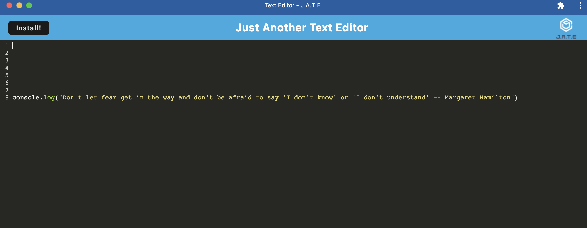

# HMT-Text-Editor

MT Notebook is a text editing application that allows users to create notes or code snippets with or without an internet connection. The data is stored in an IndexedDB database inside users' browser for easy access. This application is built using start code. 

## Getting Started

An install button is on the landing page allows users to install the application.

## Built With

* [Javascript](https://developer.mozilla.org/en-US/docs/Web/JavaScript)
* [Node.js](https://nodejs.org/en/)
* [Express](https://expressjs.com)
* [IndexedDB API](https://developer.mozilla.org/en-US/docs/Web/API/IndexedDB_API)
* [Heroku](https://heroku.com)

## Deployed Link

* [Link to Heroku](https://hmt-text-editor.herokuapp.com/)
* [Link to Github](https://github.com/MANDYTSANG007/HMT-Text-Editor)

## Design Layout

## Authors

* **Mandy Tsang** 

- [Portfolio](https://mandytsang007.github.io/new-portfolio/)
- [Github](https://github.com/MANDYTSANG007)
- [LinkedIn](https://www.linkedin.com/in/man-tsang-64308b22a/)

## License

This project is licensed under the MIT License 

